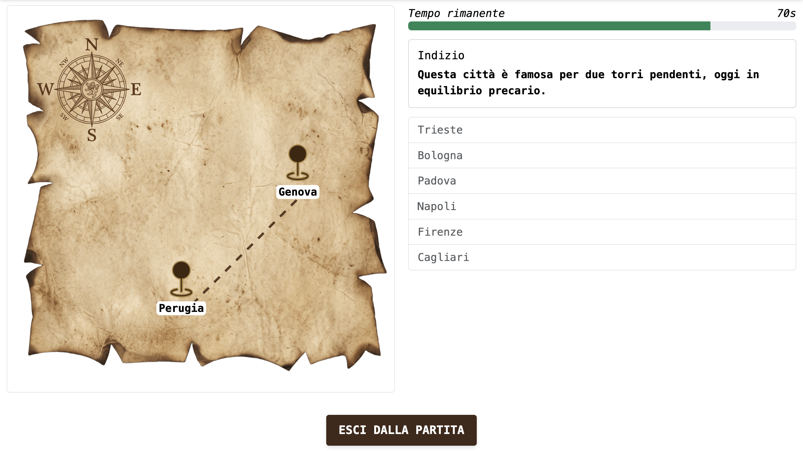
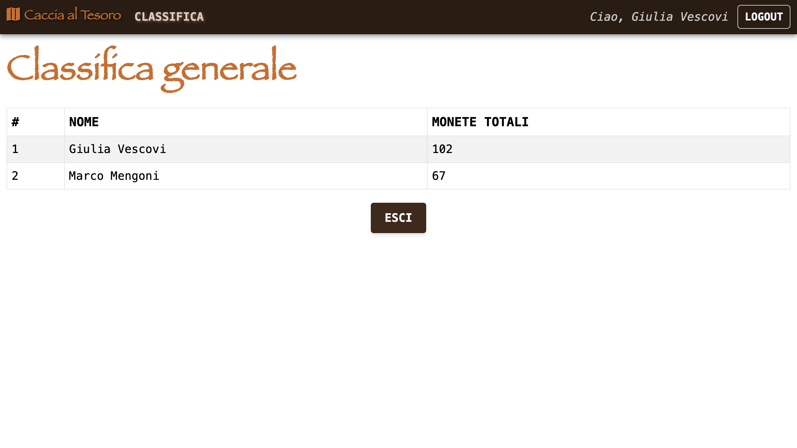

# Exam #3: "Caccia al Tesoro"
## Student: VESCOVI GIULIA 

## React Client Application Routes

- Route `/`: 
  - Contenuto: Mostra il componente `<Home>` che rappresenta l'homepage dell'applicazione.
  - Obiettivi: Permettere a tutti gli utenti di visualizzare le istruzioni di gioco e di iniziare una partita effettuando il login.

- Route `/login`:
  - Contenuto: Se l'utente è già autenticato, reindirizza automaticamente alla route principale (`/`). Altrimenti, mostra il componente `<LoginForm>` per consentire all'utente di effettuare il login.
  - Obiettivo: Gestire l'autenticazione degli utenti attraverso il form di login, aggiornare lo stato di autenticazione dell'utente e visualizzare eventuali messaggi di errore.

- Route `/game`: 
  - Contenuto: Mostra il componente `<GamePage>` che gestisce la schermata di gioco.
  - Obiettivo: Offrire un'interfaccia interattiva per giocare, scegliere la difficoltà e visualizzare i risultati.

- Route `/leaderboard`: 
  - Contenuto: Mostra il componente `<LeaderBoard>` che rappresenta la classifica generale di tutti gli utenti che hanno giocato almeno una partita.
  - Obiettivo: Permettere agli utenti autenticati di visualizzare le monete totali vinte e la loro posizione rispetto agli altri utenti.

- Route `*` (NotFound):
  - Contenuto: Mostra il componente `<NotFound>` quando l'URL non corrisponde a nessuna delle route definite.
  - Obiettivo: Gestire i casi in cui l'utente tenta di accedere a una pagina non esistente, fornendo un'interfaccia utente appropriata per gestire l'errore.

## API Server

- POST `/api/sessions`
  - Description: Effettua il login.
  - Request parameters: _None_
  - Request body: Oggetto JSON contenente `credentials` (username, password).
  ```
  { 
    "username": "vesco", 
    "password": "password"
  }
  ```
  - Response: `200 OK` con l'utente autenticato, oppure `401 Unauthorized` (fallimento, non autenticato).
  - Response body: Oggetto JSON che rappresenta l'utente autenticato.
  ```
  { 
    "idUser": 2, 
    "username": "vesco", 
    "name": "Giulia Vescovi" 
  }
  ```

- GET `/api/sessions/current`
  - Description: Verifica se l'utente è ancora loggato.
  - Request parameters: _None_
  - Request body: _None_
  - Response: `200 OK` con l'utente autenticato, oppure `401 Unauthorized` (fallimento, non autenticato).
  - Response body: Oggetto JSON che rappresenta l'utente autenticato.
  ```
  { 
    "idUser": 2, 
    "username": "vesco", 
    "name": "Giulia Vescovi" 
  }
  ```

- DELETE `/api/sessions/current`
  - Description: Effettua il logout (elimina anche l'eventuale partita in corso).
  - Request parameters: _None_
  - Request body: _None_
  - Response: `200 OK` (successo).

- GET `/api/leaderboard`
  - Description: Totale monete vinte da ogni utente registrato che ha giocato almeno una partita.
  - Request parameters: _None_
  - Request body: _None_
  - Response: `200 OK` (successo), `401 Unauthorized` (non autenticato), `503 Service Unavailable` (errore del database).
  - Response body: Oggetto JSON che rappresenta la classifica generale, ordinata per monete decrescenti.
  ```
  [
    { "name": "Giulia Vescovi", "totalCoins": 102 },
    { "name": "Marco Mengoni", "totalCoins": 67 }
  ]
  ```

- POST `/api/games`
  - Description: Crea una nuova partita per l'utente loggato, alla difficoltà scelta.
  - Request parameters: _None_
  - Request body: Oggetto JSON contenente `difficulty`.
  ```
    { "difficulty": "easy" }
  ```
  - Response: `200 OK` con lo stato iniziale della partita, oppure `401 Unauthorized` (non autenticato), `422 Unprocessable Entity` (`difficulty` non valida), `503 Service Unavailable` (errore del database).
  - Response body: Oggetto JSON che rappresenta lo stato iniziale della partita.
  ```
    {
      "difficulty": "easy",
      "treasureCoins": 45,
      "totalTime": 60,
      "pathLength": 3,
      "status": "playing",
      "visited": [],
      "clue": {
        "text": "In questa città svetta una guglia altissima, oggi sede di un museo dedicato al cinema.",
        "options": [
          { "idLocation": 1, "name": "Torino" },
          { "idLocation": 2, "name": "Milano" },
          { "idLocation": 3, "name": "Venezia" },
          { "idLocation": 4, "name": "Verona" },
          { "idLocation": 5, "name": "Padova" },
          { "idLocation": 6, "name": "Trieste" }
        ]
      }
    }
  ```

- GET `/api/games/current`
  - Description: Restituisce lo stato della partita attualmente in corso per l'utente loggato (ne esiste al più una alla volta).
  - Request parameters: _None_
  - Request body: _None_
  - Response: `200 OK` con lo stato della partita, oppure `401 Unauthorized` (non autenticato), `404 Not Found` (nessuna partita in corso), `503 Service Unavailable` (errore del database).
  - Response body: Oggetto JSON. La forma cambia in base a `status`: se è `"playing"` è identica alla risposta di `POST /api/games` (con `visited` eventualmente non vuoto); se è `"won"` o `"lost"` include anche `coinsWon` e il percorso completo `path`.:
  ```
    {
      "difficulty": "easy",
      "treasureCoins": 45,
      "totalTime": 60,
      "pathLength": 3,
      "status": "won",
      "visited": [
        { "idLocation": 3, "name": "Venezia", "x": 60, "y": 20, "pathOrder": 0 },
        { "idLocation": 7, "name": "Genova", "x": 25, "y": 55, "pathOrder": 1 },
        { "idLocation": 11, "name": "Roma", "x": 75, "y": 70, "pathOrder": 2 }
      ],
      "coinsWon": 45,
      "path": [
        { "idLocation": 3, "name": "Venezia", "x": 60, "y": 20, "pathOrder": 0 },
        { "idLocation": 7, "name": "Genova", "x": 25, "y": 55, "pathOrder": 1 },
        { "idLocation": 11, "name": "Roma", "x": 75, "y": 70, "pathOrder": 2 }
      ]
    }
  ```

- POST `/api/games/answers`
  - Description: Invia il luogo scelto in risposta all'indizio corrente.
  - Request parameters: _None_
  - Request body: Oggetto JSON contenente `idLocation`.
  ```
    { "idLocation": 3 }
  ```
  - Response: `200 OK` con lo stato aggiornato, oppure `401 Unauthorized` (non autenticato), `404 Not Found` (nessuna partita in corso, o già conclusa), `422 Unprocessable Entity` (`idLocation` non valido), `503 Service Unavailable` (errore del database).
  - Response body: Oggetto JSON, stessa forma di `GET /api/games/current` (dipende da `status`: `"playing"` se la risposta era corretta ma il percorso non è ancora concluso, `"won"`/`"lost"` altrimenti).

## Database Tables

- Table `clues` - usata per memorizzare gli indizi associati a ciascun luogo 
  - contains: idClue idLocation text

- Table `games` - usata per memorizzare le partite concluse, sia vinte che perse 
  - contains: idGame idUser difficulty treasureCoins startTime totalTime status currentStep coinsWon

- Table `locations` - usata per memorizzare i luoghi 
  - contains: idLocation name

- Table `users` - usata per memorizzare gli utenti registrati 
  - contains: idUser username name hash salt

## Main React Components

- `Header` (in `Header.jsx`): è responsabile della creazione dell'intestazione della navigazione dell'applicazione. Se l'utente è autenticato (loggedIn è true), sulla destra viene mostrato un messaggio di benvenuto con il nome dell'utente e il tasto per effettuare il logout (Logout), mentre sulla sinistra presenta il bottone per accedere alla classifica. 

- `Home` (in `Home.jsx`): rappresenta la pagina iniziale dell'applicazione, visibile a chiunque. Mostra le istruzioni di gioco e un bottone che porta al login (per gli utenti anonimi) oppure direttamente alla creazione di una nuova partita (per gli utenti già autenticati).

- `GamePage` (in `GamePage.jsx`): gestisce l'intero ciclo di vita di una partita attraverso un'unica variabile di stato con tre fasi possibili. Se non è ancora stata scelta una difficoltà, mostra il selettore di difficoltà (componente `DifficultySelector`); durante lo svolgimento della partita, mostra la mappa (`GameMap`), il tempo rimanente (`Timer`) e l'indizio corrente con le opzioni tra cui scegliere (componente `Clue`); a partita conclusa (vinta o persa), mostra l'esito, il percorso completo sulla mappa e i bottoni per uscire o iniziare una nuova partita.

- `GameMap` (in `GameMap.jsx`): disegna la mappa del tesoro sovrapponendo, all'immagine di sfondo, un pin per ogni luogo visitato (con il nome della città), una X sul luogo del tesoro, e una linea tratteggiata che collega le tappe nell'ordine in cui sono state raggiunte.

- `Timer` (in `Timer.jsx`): Il componente Timer si occupa della gestione del tempo messo a disposizione per ogni partita. Utilizza l'API per verificare, tramite il server, quando il tempo è definitivamente terminato.

- `LeaderBoard` (in `LeaderBoard.jsx`): gestisce la visualizzazione della classifica generale. Utilizza l'API per recuperare tutte le monete vinte da ciascun utente durante il corso delle partita. Mostra una tabella con tre colonne: la posizione in classifica, il nome dell'utente e le monete totali.

- `LoginForm` (in `Login.jsx`): è responsabile di mostrare un modulo di login all'interno di un container. Al momento della presentazione, l'utente può inserire le proprie credenziali e inviarle tramite il pulsante "Login". In caso di mancato inserimento dei campi richiesti, viene visualizzato un messaggio di errore.

(only _main_ components, minor ones may be skipped)

## Screenshot




## Users Credentials

- username: mengo,  password: password
- username: vesco,  password: password
- username: emma,   password: password

## Get Started

1) Open a new terminal inside the directory
2) cd server
    1. npm install
    2. npm index.js
3) Open another terminal inside the directory
4) cd client
    1. npm install
    2. npm run dev


